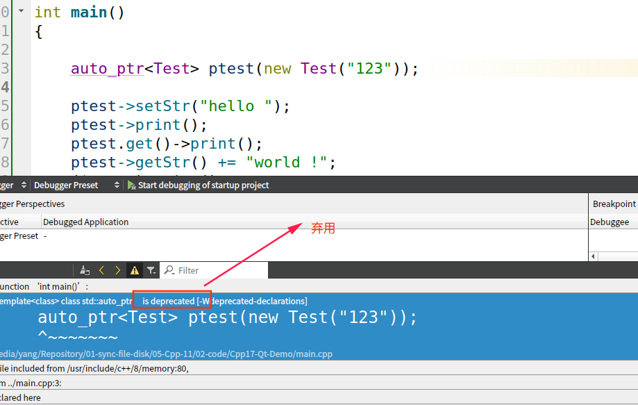

# [智能指针的用法](./)  [img](./img)     

> ######  _标签:_              
>

## 0 auto_ptr    [官方文档](http://www.cplusplus.com/reference/memory/auto_ptr/?kw=auto_ptr)   

自动指针 [已弃用]
注意：从 C++11 开始不推荐使用此类模板。 unique_ptr 是一种具有类似功能的新工具，但具有改进的安全性（无虚假复制分配）、添加的功能（删除器）和对数组的支持。有关其他信息，请参阅 unique_ptr。

这个类模板为指针提供了一个有限的垃圾收集设施，通过允许指针在 auto_ptr 对象本身被销毁时自动销毁它们指向的元素。

auto_ptr 对象具有获取分配给它们的指针的所有权的特性：拥有一个元素的所有权的 auto_ptr 对象负责销毁它指向的元素，并在其自身被销毁时释放分配给它的内存。析构函数通过自动调用 operator delete 来完成此操作。

因此，没有两个 auto_ptr 对象应该拥有相同的元素，因为它们都会在某个时候试图破坏它们。当两个 auto_ptr 对象之间发生赋值操作时，所有权被转移，这意味着失去所有权的对象被设置为不再指向元素（它被设置为空指针）。   

  

  
